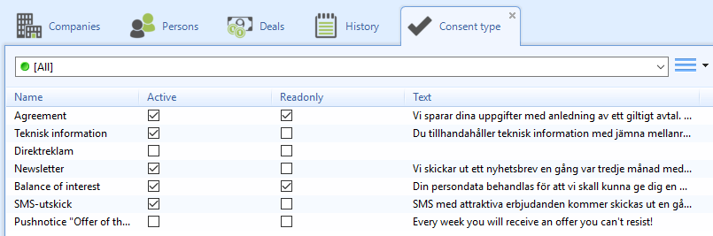
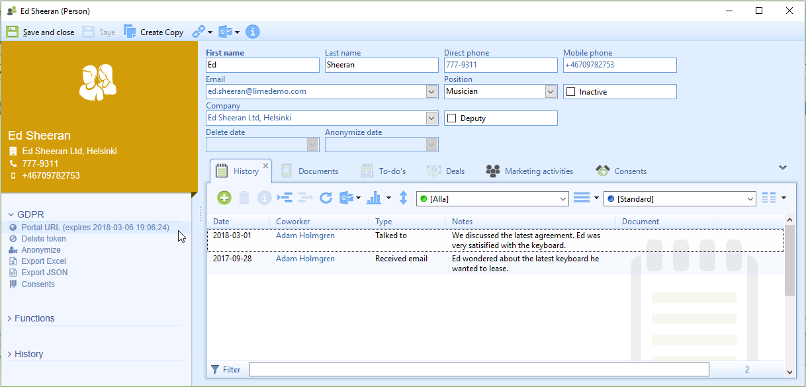
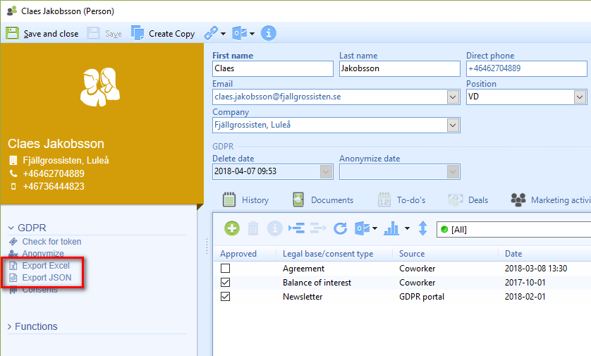
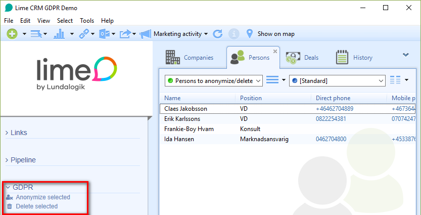
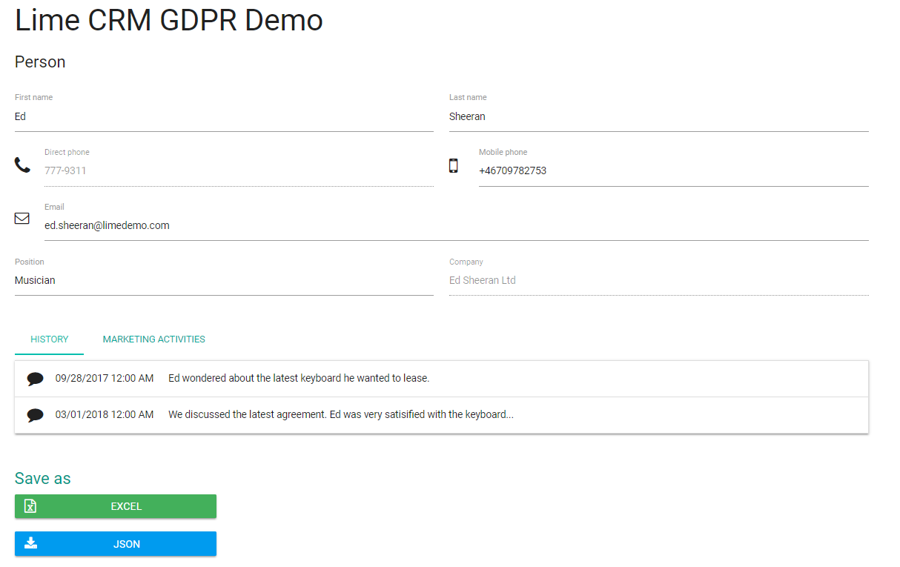

##Rätt till information om när personuppgifter behandlas
Du behöver kundens samtycke till att spara och behandla data, skicka nyhetsbrev och för att kunna behandla deras information på något annat sätt.

**I Lime CRM** kommer du kunna specificera ert syfte för lagring av information. Till exempel, ”Vi behöver lagra kundinformation för att kunna sälja våra produkter”. Detta syfte blir också synligt för kunden genom GDPR-portalen, när användaren ger dem access till sin personliga data.

Vilken typ av samtycke som är tillgänglig kan enkelt konfigureras av administratörer direkt i Lime CRM.

___
##Rätt till åtkomst
Du måste ge kunden tillgång till den information som finns om han eller henne när kunden ber om det.

I Lime CRM kommer du kunna söka efter kunden och sen klicka på en länk i Actionpaden, som skickar en länk till en temporär webbsida. Där kan kunden se och redigera sin personliga data som finns i Lime CRM. Länken är tillfällig och fungerar bara under en begränsad tid.

Vilken data som visas och vilken som är redigerbar av kunden, på portalen, kan konfigureras efter hur just er CRM-lösning ser ut.

___
##Rätt att få information rättad

Kunden har rätt att få sina uppgifter rättade.

**I Lime CRM** kan kunden enkelt korrigera sina personuppgifter via GDPR-portalen. Det är också möjligt för dig att korrigera data på kundens begäran, direkt i Lime CRM.
___
##Rätt till dataöverföring
Kunden har rätt till att få en kopia av sina personuppgifter som är lagrade av användaren.

**I Lime CRM** kan kunden enkelt exportera sin data från GDPR-portalen. Man kan välja att exportera till Excel eller JSON. Som användare i Lime CRM har du samma funktionalitet via Actionpaden.

___
##Incident och dataintrång

Vid en personuppgiftsincident måste du informera samtliga berörda kunder inom 72 timmar. Till exempel, om du misstänker att någon obehörig har fått tillgång till din kunddatabas måste alla berörda kunder kontaktas.

Med den redan inbyggda standardfunktionaliteten för massutskick i Lime CRM, kan du enkelt kontakta kunder som eventuellt blivit berörda av en personuppgiftsincident.
___
##Rätt till att bli bortglömd
Kunden kan be om att få sin data ”raderad”. I Lime CRM sker detta genom anonymisering. När kunden ber om att få bli anonymiserad sätts ett slutdatum för när kunden ska anonymiseras.

___
##GDPR-portalen
GDPR-portalen är där kunden kan få tillgång till all personlig data som finns samlad I Lime CRM, och där kunden kan göra följande:

**1. Se sin personliga och relaterade data..
2. Redigera viss data som synkas direkt med Lime CRM..
3. Exportera personlig data.** Datan kan exporteras direkt av kunden i formaten Excel eller JSON. Se vilket som kunden har gett, återkallat, vill lägga till eller ta bort.

